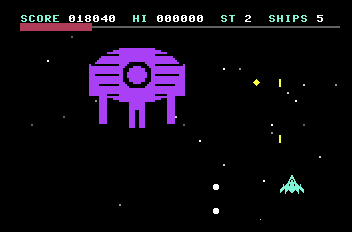

# vice64-mcp

An MCP server that gives an AI assistant full control of the **VICE Commodore 64 emulator**: run programs, see the screen, press keys and joystick, read and write memory, set breakpoints, and assemble 6502 code straight into the machine.

It talks to VICE through its **binary monitor protocol** (VICE 3.5+), one persistent socket and no screen scraping, so it's fast and doesn't freeze or drop the emulator.



*NEON RAID, a shoot 'em up written and play-tested by Claude entirely through this MCP. See [examples/neonraid](examples/neonraid).*

## Setup

1. Install [VICE](https://vice-emu.sourceforge.io/) 3.5 or newer, and [Node.js](https://nodejs.org/) 18+.
2. Clone and install:
   ```bash
   git clone https://github.com/nutshot2000/vice64-mcp.git
   cd vice64-mcp
   npm install
   ```
3. Register it with your MCP client. For Claude Code:
   ```bash
   claude mcp add vice -- node /path/to/vice64-mcp/src/server.js
   ```
   Other clients: run `node src/server.js` as a stdio MCP server.

The server finds `x64sc` on its own: first `VICE_EXE`, then your `PATH`, then common install folders (Program Files, Desktop, Downloads, Documents, /Applications, /opt...). The first tool call launches VICE with the binary monitor enabled, or connects to one you started yourself with `x64sc -binarymonitor`.

| Environment variable | Default | Purpose |
|---|---|---|
| `VICE_EXE` | auto-detected | Full path to `x64sc` |
| `VICE_PORT` | `6502` | Binary monitor port |

## Tools (31)

**Emulator:** `vice_start`, `vice_status`, `vice_quit`, `vice_reset`, `vice_warp`, `vice_resource` (any VICE setting), `vice_snapshot` (save/load .vsf)

**Programs**
- `vice_assemble`: built-in two-pass 6502 assembler. Labels, `@local` labels, expressions, `.byte .word .text .scr .fill .align`, `.bits "..##.."` for sprite art, `.include`, and `.basic` for a `SYS` stub. It loads into RAM or autostarts in about 250 ms.
- `vice_symbols`: lists the labels from the last build. Every address parameter in every tool accepts labels and expressions such as `score+2`, and symbols survive server restarts.
- `vice_autostart` (.prg/.d64/.t64/.crt/...), `vice_run_basic` (tokenised with VICE's petcat), `vice_load_prg` (inject without a reset)

**Screen and input**
- `vice_screen_text`: the 40×25 text screen, decoded wherever the VIC-II is pointing
- `vice_screenshot`: a PNG of the real display
- `vice_type`: types through the KERNAL keyboard buffer, with PETSCII `{CODES}`
- `vice_keys`: real key presses on the C64 keyboard matrix, so it works with games that scan the keyboard directly (Windows)
- `vice_joystick`: port 1 or 2
- `vice_input_sequence`: scripted play-testing. Joystick and keys per step, with screenshots and memory watches at chosen steps.
- `vice_wait`, `vice_wait_for_text`

**Debugging:** `vice_memory_read` (hex dump, disassembly, screen codes), `vice_memory_write`, `vice_disassemble` (label-annotated), `vice_registers`, `vice_pause`, `vice_resume`, `vice_step` (into/over/out), `vice_breakpoint_set` (exec/load/store, conditions), `vice_breakpoint_list`, `vice_breakpoint_delete`, `vice_wait_for_breakpoint`

## How it works (and gotchas)

- **Every monitor command pauses the CPU.** Tools resume it afterwards, unless you paused, stepped, or hit a breakpoint. `vice_status` shows which.
- **The emulator window is shared with you.** If you're playing in VICE while the AI works, resets, autostarts and memory writes hit your session. The server tells the AI to check or ask first.
- **Joystick input:** the monitor's joyport command drives VICE's "Joyport I/O simulation" device. The server plugs that device into the port only while a direction is held, then puts your own device back.
- **Keys:** `vice_type` fills the KERNAL keyboard buffer, so games that switch off interrupts never see it. `vice_keys` posts real key events to the VICE window without taking focus. It's Windows-only for now and uses VICE's default symbolic keymap.
- **Warp:** VICE 3.10 has no warp command in the binary monitor, so warp means a very high speed limit, about 30× real time, with sound muted. Sound errors out at that speed otherwise.
- **Fast autostart:** freshly built PRGs are autostarted with RAM injection instead of VICE's default emulated-disk load.

## Tests

```bash
node test/asm-test.js      # assembler self-test (no VICE needed)
node test/smoke.js         # end-to-end: quits and relaunches VICE, then exercises the tools
node test/drive.js '[["vice_screenshot",{}]]' [outdir]   # run any tool sequence in one session
```

`smoke.js` restarts VICE, so don't run it while you're playing something.

## Example: NEON RAID

[`examples/neonraid`](examples/neonraid) is a complete vertical shooter: formations on flight paths, four enemy types, P/S/B power-up capsules, a 4-sprite boss with attack patterns, SID sound, a starfield, and redefinable keys. It was built by an AI with `vice_assemble` and tested with `vice_input_sequence`, memory watches and breakpoints. Build it with:

```
vice_assemble { "path": ".../examples/neonraid/neonraid.asm" }
```

Or just drop `neonraid.prg` onto VICE. Default keys are O/P/Q/A and Space, or use a joystick in port 2. F1 on the title screen redefines the keys.

## License

MIT. Free for anyone to use, modify and share. See [LICENSE](LICENSE).
